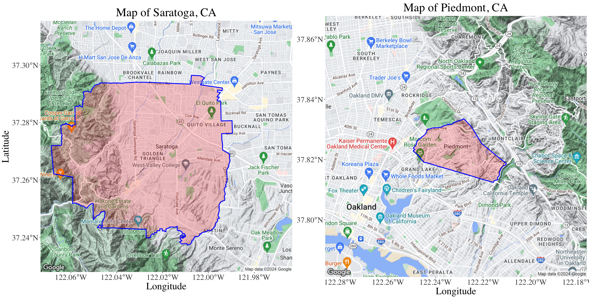

## Why I Love Data Visualization

My favorite assignments in ENV S 193DS all included problems on data visualization. I have especially become indebted to several packages designed by R's Hadley Wickham, including `ggplot2` and `ggmap`.

Outside of ENV S 193DS, I have also learned to use the `ggmap` and `sf` packages to create informative maps. This knowledge was especially useful for my assignments in POL S 162 - Urban Government and Politics, where several projects involving data collection and analysis were assigned.

### Maps

This map shows the boundaries and area for two Northern California cities, paired in a project investigating the success of their Housing Element submissions to the California Department of Housing and Community Development. The purpose of this map was to illustrate the difference in size between the two cities, which led to different approaches towards plans for new housing units for each city. To create this map, I used several spatial packages, including `sf`, `ggmap`, and gridExtra. Shapefiles for the city boundaries and areas were provided under an ArcGIS dataset provided by the California Department of Forestry and Fire Protection. In my final report, I noted that Saratoga's planned housing development was centered around the northeastern portion of the city, near the Quito Village area. This, in contrast with Piedmont's decision to spread its planned housing units along the city, resulted in HCD's ruling that Saratoga's housing element was non-compliant with state law, even when it had more area for housing development than Piedmont.
