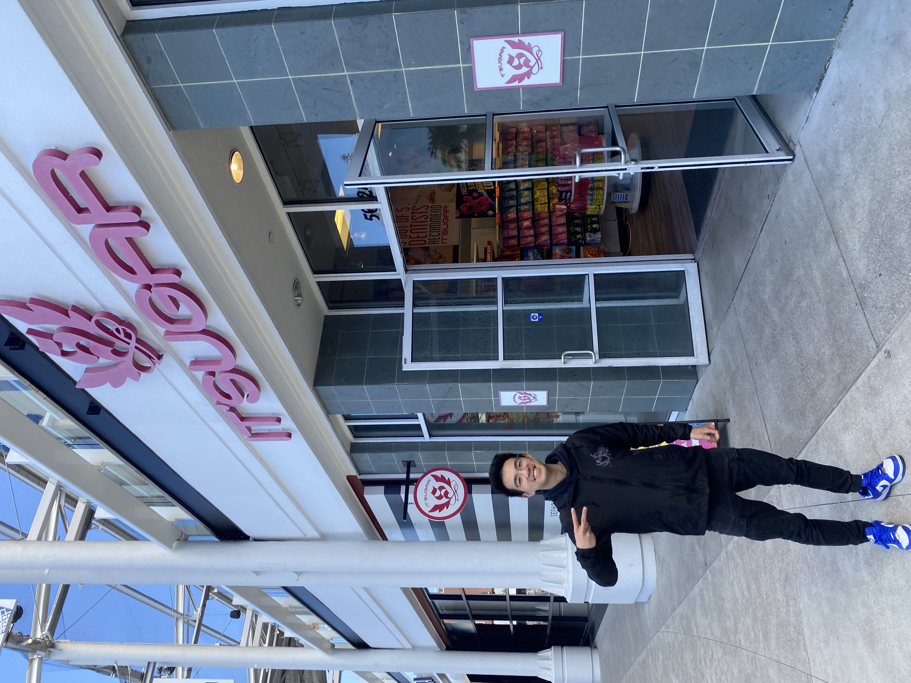

I was born in Hayward, California, but have lived in neighboring Fremont for much of my life. As a kid, I was fascinated with riding the [Bay Area Rapid Transit (BART)](bart.gov) system (and maybe becoming a train operator for it someday), computers, baseball, and becoming the President of the United States. Needless to say, none of them are as interesting now as they were in the past, for fairly amusing reasons.

For much of my life, however I have always wanted to explore the history of everything I'm interested in, whether it's the school I visit, the trains I ride to get there (thanks Amtrak!), or even video games that I'm interested in. My research interests stemmed from the questions I asked specifically about the United States Supreme Court: how did it define its own role in the United States government over time? Similarly, though I found out I was definitely not interested in becoming a computer engineer after I was fairly lost while reading @patterson1994a, I was still excited to learn about the history of computers, and how political scientists and lawyers can still benefit from advances in computer technology. I was excited to find that political science is becoming more and more reliant on big data and statistical analysis. My early computer literacy has definitely paid off!

In my spare time, I enjoy following the esports scene (especially for games like *Counter-Strike 2* or *VALORANT*), reading non-fiction books on the Supreme Court, political history, and , and spending more money on pickleball rackets and balls, while my rating continues to stagnate at 3.5. At home, the stores I like to visit include IT'SUGAR, for my candy fix; the Razer store, for when I forget that every professional video game player should be able to play well with any type of mouse and keyboard; and Half-Price Books, for more books on statistics, economics, and political science/law!

{width="376"}
