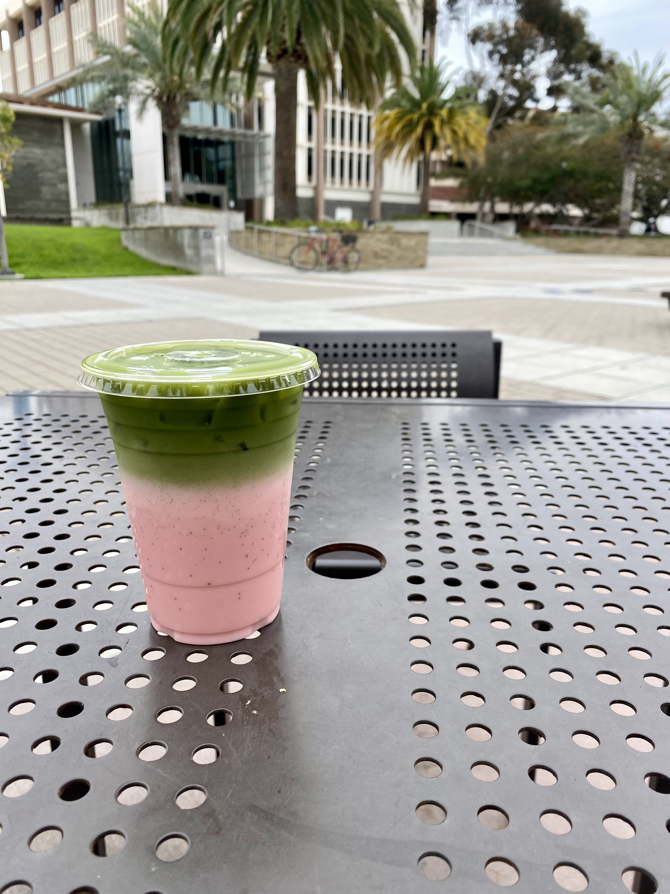

I've also recently gotten into photography thanks to a high school digital photography course I took in my senior year. One of the unfortunate consequences of moving to UCSB is that I no longer have my own camera to use; nevertheless, Santa Barbara as a whole is extremely photogenic and I plan to take more pictures once I am able to obtain a new camera in the future.

Here are some pictures I have taken, either outside of school or for my digital photography course:

{width="420"}
