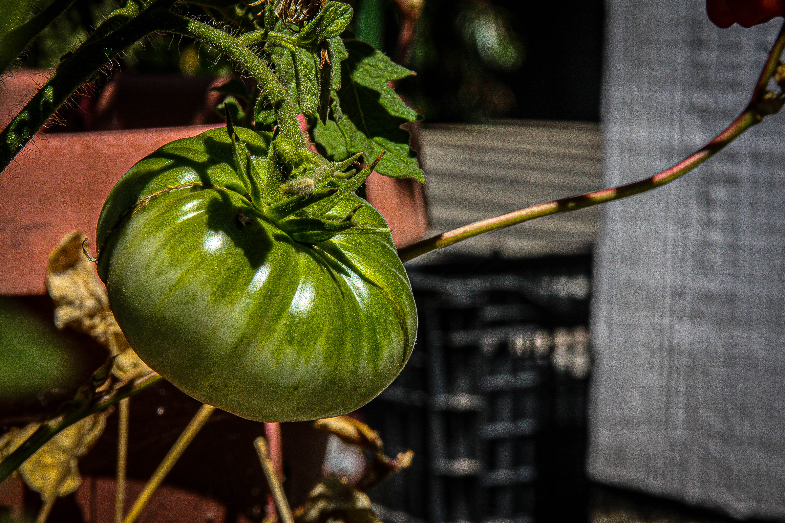
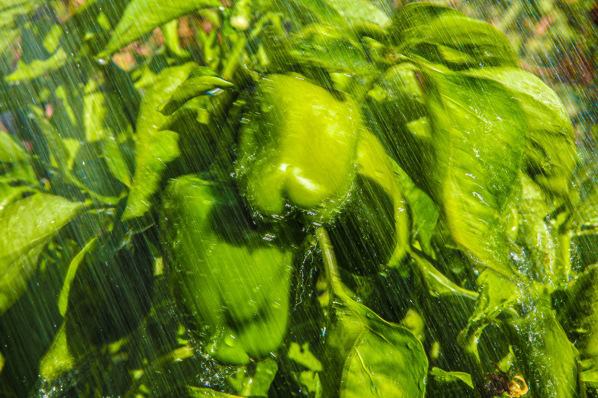

I've also recently gotten into photography thanks to a high school digital photography course I took in my senior year. One of the unfortunate consequences of moving to UCSB is that I no longer have my own camera to use; nevertheless, Santa Barbara as a whole is extremely photogenic and I plan to take more pictures once I am able to obtain a new camera in the future.

Here are some pictures I have taken, either outside of school or for my digital photography course:

## At UCSB

{group="photos" fig-align="left" width="532"}

## At Home

::: {layout="[[1, 1], [1]]"}
{width="533" group="Back at Home" description="The waves break off the coast of Aquinnah on a beautiful summer day."}

{width="589" group="Back at Home" description="A massive, unripe tomato that eventually fell to a swarm of bugs."}

{group="Back at Home" description="Courtesy of my mom, these bell peppers were watered and eventually picked as part of my mother's fall harvest!" fig-align="left" width="690"}
:::
